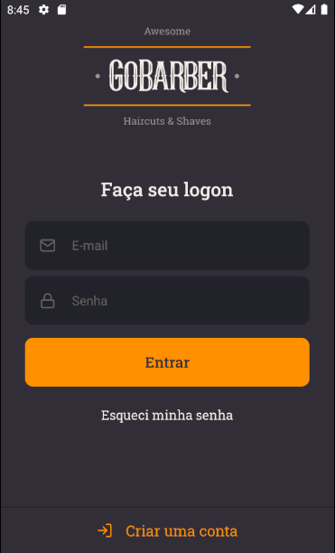

<p align="center">
  
</p>
<h1 align=center>GoBarber - Mobile</h1>
<p align="center">This APP can be usefull when you've a barbershop and needs to control the clients and employees scheduler's.</p>

## :computer: Tech:
- React Native
- React Navigation
- Unform
- Hooks
- Axios
- ESLint + Prettier

## Dependencies
Before start the app make sure you've the backend up and running: https://github.com/acpn/gobarber-server

## :running: Run the project:
```shell
  # Clone this repository
  - git clone git@github.com:acpn/gobarber-app.git

  # Enter project directory
  - cd [project folder]

  # Install dependencies
  - yarn

  # Run the APP:
  Before start the app make sure you have an emulator running.
  
  - yarn android (in case you are using Android)
  - yarn ios (in case you are using iOS)

```

## :fork_and_knife: Contributing
- Fork this repository;
- Create a branch for your features;
- Push your branch.
